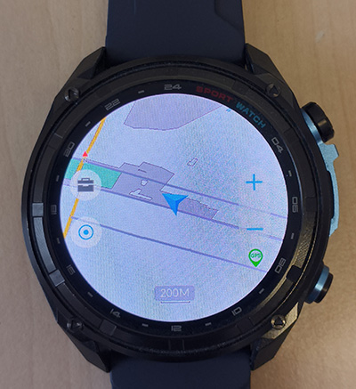
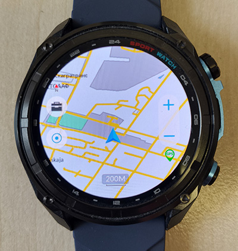
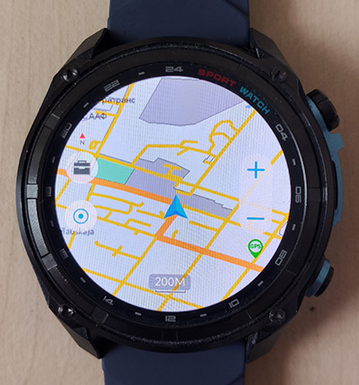
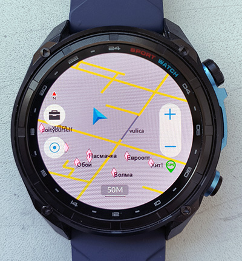

# Custom Offline Maps for DT NO.1 G1 / VWAR / KKTICK / Amolde HD300 Pro
**(ATS3085S Hardware Platform, Zephyr RTOS Software Platform)**

🇷🇺 [Читать на русском](README_ru.md)

If you are looking for **how to install custom maps on a smartwatch** or need better **DT NO.1 G1 offline maps** to sync via the **WearPro** app, this project provides a complete open-source solution. 
➡️ **[Download the ready-made compiler (.EXE) for Windows]** [](https://github.com/purrrock/dtg1-map-tools/releases/latest)

A set of Python utilities for reverse engineering, analyzing, and compiling custom offline maps for DT NO.1 G1, VWAR, KKTICK and Amolde smartwatches (as well as other white-label devices based on the Actions Semiconductor ATS3085S hardware platform). If you are looking for how to install custom maps on a smartwatch or need better DT NO.1 G1 offline maps to sync via the WearPro app, this project provides a complete open-source solution.
The toolset allows building your own highly detailed maps from open sources (e.g., OpenStreetMap). These custom maps are natively hardware-supported and perfectly rendered by the watch's built-in graphics engine. 

> **⚠️ Disclaimer:** This is an unofficial project created exclusively through reverse engineering ("black box" and byte-by-byte analysis of memory dumps). The use of these utilities and flashing of modified files to the watch is done at your own risk.

---

## 🚀 Core Compiler Features

The compiler has been significantly upgraded to bypass native firmware limitations and optimize resource consumption:
* **Country-Sized Map Support (Hierarchical R-Trees):** Generates true STR (Sort-Tile-Recursive) spatial index trees. By utilizing nested Macro-nodes and calculating recursive byte jumps (`v3_jump`), the compiler allows the watch's graphics coprocessor to skip entire regions in a single instruction. This bypasses SRAM limits and ensures butter-smooth panning on maps of any size.
* **Point of Interest (POI) Icon Baking:** Circumvents the hardware graphics pipeline limitation (which natively drops POI rendering) by parametrically "baking" point objects into the landuse layer. Generates low-poly geometric primitives (triangles, squares, hexagons) with automatic display perspective distortion compensation (Y-multiplier = 1.5).
* **Software Culling (Early Exit Parsing):** Highly optimized two-pass XML streaming (`xml.etree.ElementTree.iterparse`). Drops disabled routing nodes immediately during tree traversal via the 11th column (`Enabled`) in the LUT configuration.
* **Dynamic Hardware Overrides (Tag Interception):** Overrides standard LUT routing rules on the fly based on multidimensional OSM tags.
    * *Road Surface Analysis:* Dynamically analyzes `surface` and `smoothness` tags. Automatically downgrades routing classes (e.g., primary roads) to unpaved gray paths if `smoothness=bad` or `surface=dirt`. Preserves original LUT colors for non-vehicle infrastructure (footways, cycleways) via an internal exclusion mask.
    * *Access Restrictions:* Physical barriers with restricted access (`access=private/no/permit`) are intercepted prior to LUT evaluation and forced into pink diagonal crosses.
* **Namespace Collision Isolation:** Blacklist registries are strictly isolated by layer (`pois`, `roads`, `landuse`, `water`) to prevent `fclass` routing conflicts between differently categorized objects.
* **GPX Track Integration:** Natively compiles custom `.gpx` user routes directly into the hardware vector graph.
* **Advanced Key-Value Tag Routing:** Fully parses the `OSM_Tags` column from `features.csv` to resolve namespace collisions. Objects are strictly routed using precise `key=value` hash table lookups (e.g., `shop=bicycle -> bicycle_shop`) before applying fallback heuristics. This ensures all complex GIS classes are compiled without data loss.

---

## 📸 Comparison: Factory Map vs. Custom Compiled Map

| Factory Map | Custom Compiled Map | Custom Map with Route| Custom Map with POIs|
| :---: | :---: | :---: | :---: |
|  |  |  |  |

---

## 📂 Toolkit Composition

The project has transitioned to a fully **modular architecture** for better maintainability and isolated debugging. The codebase provides 100% binary compatibility with the hardware parser of the watch and includes:

* **`dtg1_map_compiler.py`** — Main CLI Orchestrator. Coordinates the map building process.
* **`dtg1_models.py`** — Data structures and system constants (`MapFeature`, `HWConfig`).
* **`dtg1_osmparser.py`** — Map and route parsing logic (`OSMParser`, `GPXParser`).
* **`dtg1_geometry.py`** — Geometric algorithms and POI baking (`POIGeometryFactory`).
* **`dtg1_bin_writer.py`** — Low-level binary serialization for target files (`MapCompiler`).
* **`dtg1_lookup.py`** — Advanced LUT configuration and tag routing (`LookupTables`).
* **`features.csv`** — Modifiable style routing table (LUT) with software culling (Blacklist) support.
* **`features_factory.csv`** — Original dump of the factory style table.
* **`make_exe.cmd`** — Batch script to compile the project into a standalone `.exe` for Windows using PyInstaller.
* **`dtg1_map_specification.md`** — Technical format specification. Contains the byte-by-byte structure of `.mlp`, `.idx`, and `.db` files.

---

## ⛰️ Elevation Contours (Experimental Community Tools)

Thanks to contributions from the XDA-Developers community, the repository now includes experimental utilities for processing topographic elevation contours (located in the `/contours` directory). These scripts allow you to merge elevation LineStrings into your base OpenStreetMap data before compilation. 

> **⚠️ CRITICAL HARDWARE WARNING:** The ATS3085S graphics coprocessor has strict limitations on the number of simultaneous vectors it can draw. Elevation contours consist of thousands of dense points. If you compile them with a high Level of Detail, the watch will experience a memory overflow.

If you use the contours feature, you MUST configure your `features.csv`. Read `/contours/README_contours.md`.

---

## 🛠 Installation and Quick Start

The compiler now supports both running from Python source code and compiling into a standalone executable!

### Option A: Standalone Executable (Windows Only)
Perfect for regular users. No Python installation required!
1. Place `dtg1_map_compiler.exe`, the `features.csv` file, and your source map.osm data into any convenient folder.
2. Run the executable via command line (e.g., `dtg1_map_compiler.exe`).

### Option B: Running from Source (Developers & Cross-Platform)
1. Ensure you have Python 3.8 or higher installed. No additional third-party dependencies are required for the core map build (the project exclusively uses built-in modules).
2. Download the repository with all its modular Python files.

### Standard Compilation Workflow
1. Export the desired map area from https://www.openstreetmap.org/export in XML format.
2. Rename the downloaded file to `map.osm` and place it in the working directory next to the compiler.
3. Run the script: `python dtg1_map_compiler.py -p landuse`
4. The compiled binary files (`roads.mlp`, `roads.idx`, `landuse.db`, `map.name`, etc.) will appear in the current directory.
5. Copy these generated files to the internal memory of the watch (usually into the `MAP/Map_Name` folder via USB connection).

---

## ⚡ Preprocessing Large Maps (Highly Recommended)

If you are compiling large areas, entire countries, or experiencing Out-Of-Memory errors on your PC during compilation, you should preprocess your raw `.osm` file using the `osm_optimizer.py` utility. The smartwatch's hardware has limitations. Rendering excessively long, continuous lines (like major highways) as single objects can cause the watch UI to freeze or trigger a Soft Reset. 

The optimizer solves this by:
1.  **Hardware-Safe Chunking:** Safely slicing extremely long linear routes into smaller segments (e.g., 100 vertices per chunk) while preserving the mathematical topology of closed polygons (lakes, forests) to prevent scanline rendering glitches.
2.  **Aggressive Metadata Stripping:** Removing heavy OSM metadata (timestamps, users, changesets) and dropping globally blacklisted tags (e.g., `power`, `building`, `addr:*`) to drastically reduce the intermediate file size. 

---

## ⚙️ Command Line Interface (CLI) Parameters

The compiler implements the management of the Points of Interest (POI) layer, the output of which is hardware-suppressed by the ATS3085S graphics engine in current firmware versions. 

Available flags:
* `-h`, `--help` — Output reference information on available arguments.
* `-p MODE`, `--poi-mode MODE` — Generation mode for the Points of Interest (POI) database.
    * `none` (default) — Completely ignore POIs during the build. Protects the database from bloating.
    * `native` — Generate original `pois.idx` and `pois.db` binaries. Useful for testing firmware reaction.
    * `landuse` — Integrate POIs into the landuse layer via dynamic shape baking.

---

## 🎨 Style Customization and Object Filtering

The `features.csv` file (Look-Up Table) is the main configuration file of the compiler. It is loaded dynamically upon each launch.

### LUT Table Structure (11 columns)

The configuration consists of 11 columns separated by a semicolon (`;`).
**Header format:**
```text
Code;fclass;Color;LOD;Layer;OSM_Tags;Description;Remap_Code;Remap_Color;Remap_LOD;Enabled;;Shape
```

**Remapping (aliasing) parameters are of particular importance:**
* **Remap_Code:** The system 32-bit ID into which the object will be forcibly converted. 
    * *Example:* Paved roads are mapped to the yellow color ID 5113.
* **Remap_LOD:** The hardware Z-Culling hide distance (in meters) at which the object will appear on the screen when zooming.

### Software Culling (Blacklist)
To protect the watch's graphics pipeline from RAM overflow and `.idx` binary graph bloating, a software culling system is implemented during the stream parsing stage. The 11th column of the configuration — `Enabled` — is responsible for filtering.

* `1` (or `true`) — The object is loaded into the compiler and participates in map generation.
* `0` (or `false`) — Muted class. Hardware-culled. The algorithm utilizes an Early Exit parsing interrupt: upon encountering a tag with the `Enabled=0` value, the parser immediately discards the XML node prior to calculating the Bounding Box. This saves CPU time and prevents replacing excluded objects with default gray or green styles.

### Factory Reset
The original style table, built through reverse engineering, is preserved in the reference file `features_factory.csv`. To revert all user modifications to colors, blacklists, and levels of detail:
1.  Delete the currently modified working file `features.csv`.
2.  Make a copy of the `features_factory.csv` file and rename it to `features.csv`.
3.  Run the build script to recompile the binaries with factory parameter values.

---

## 🗺️ Custom Route Injection (GPX)

The compiler supports direct injection of navigation tracks on top of the base map.

1.  Place your route files (`*.gpx`) in the `routes/` directory.
2.  Run the build. The script will automatically find the track and extract its name. The extracted string is compiled into the `roads.db` attribute database, ensuring the track retains its original name on the watch.
3.  The injected GPX track is converted into an object with the specific type `5111` (Motorway). This code is hardware-reserved in the watch's firmware for rendering a bold, contrasting orange line. To prevent the planned route from blending with actual motorways, all motorway objects from the source OSM file are forcibly downscaled to the yellow type `5112` (Trunk) via code substitution in `features.csv`.

*Note: To disable injection and build a clean map, simply delete the GPX files before launching.*

---

## 🔬 Reverse Engineering Tools (`/tools`)

The repository includes internal scripts used during the reverse engineering of the ATS3085S graphics pipeline: 
* `dtg1_idx_dumper.py` — A decompiler that extracts `.idx` spatial indices into readable CSV formats for binary analysis.
* `roads_fuzzer.py` — Generates a coordinate grid of geometric primitives to test hardware Z-Index rendering and C-Union structural limits.

---

## 🔮 Roadmap & Future Plans (v4.1+)

The core compilation engine is now stable. Our next major goal is to transform this CLI tool into a user-friendly "Map-as-a-Service" platform for the smartwatch community.

* [ ] **Pre-compiled Map Archives:** Regularly updated, ready-to-download map packages for entire countries or popular tourist regions. These will be hosted directly in GitHub Releases — no Python installation required for end-users.
* [ ] **Web-based GUI Generator:** A browser-based interface where users can select a custom Bounding Box (up to 50x50 km), toggle specific layers/POIs, upload their GPX track for injection, and compile the map on-demand via a backend connected to the Overpass API.